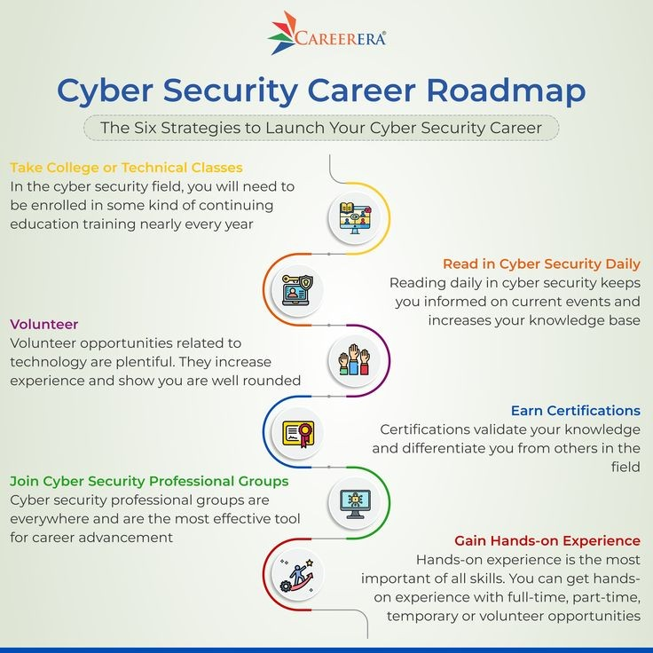

# 👋 Halo, saya AZE!

Saya adalah **pemula di dunia pemrograman** yang sedang menapaki jalan menuju **Cyber Security Analyst profesional**. Saat ini saya fokus belajar **bahasa Python** sebagai fondasi, sambil mendalami konsep dasar keamanan siber. Ini adalah tempat saya mencatat, berbagi, dan menampilkan perjalanan saya dari nol hingga expert.

---

## 🚀 Tentang Saya

- 🔐 Tujuan utama saya: **menjadi Cyber Security Analyst yang handal dan berdampak**.
- 🐍 Sedang belajar **Python** sebagai bahasa utama untuk scripting dan otomasi.
- 🧠 Saya tertarik pada **ethical hacking, network security**, dan **penetration testing**.
- 📘 Percaya bahwa **konsistensi + rasa ingin tahu = kombinasi berbahaya (positif)** dalam dunia teknologi.

---

## 🧰 Tools & Teknologi yang Sedang Saya Pelajari

---

## 🧭 Status

  <!-- Status & Goal -->
  
  
  
  <!-- Mindset & Focus -->
  
  
  
  <!-- Education & Path -->
  
  

  <!-- Networking & Status -->
  
  

---

## 🧪 Proyek & Latihan (Segera Dimulai)

Saat ini saya sedang **menyusun rencana dan roadmap pembelajaran**. Beberapa hal yang ingin saya eksplorasi dalam waktu dekat:

- 📌 Menulis script Python sederhana untuk automasi
- 📌 Mengenal tools dasar keamanan jaringan (contoh: Wireshark, nmap)
- 📌 Simulasi lab jaringan lokal menggunakan VirtualBox/Kali Linux
- 📌 Mulai tantangan dasar dari platform seperti TryHackMe atau OverTheWire

Saya akan mulai membangun proyek kecil dan mendokumentasikannya di GitHub ini.

---

## 🎯 Perjalanan Menuju Cyber Security:
- 📅 2025: Fokus Python + dasar keamanan jaringan
- 📅 2026: Belajar ethical hacking & tools CTF 
- 📅 2027: Siap bersertifikasi dan bekerja di dunia cyber security!

---

## 📬 Kontak

Saya terbuka untuk berdiskusi, kolaborasi, dan mentorship:

- ✉️ Email Pribadi: azezo696969@gmail.com  
- 💼 Email Bisnis/Organisasi: hermeseyesteam@gmail.com
- 🎩 Instagram Pribadi: https://www.instagram.com/zaviron_?igsh=cHF1NnNvZGticzlh
- 🎯 Instagram Bisnis/Organisasi: https://www.instagram.com/hermeseyesteam

---

## 🤝 Tim & Organisasi

Saya juga aktif membangun dan belajar bersama tim:

### 🛡️ Hermes Eyes
- Organisasi kecil pelajar yang fokus pada **Cyber Security, Open Source, dan Kolaborasi Belajar**.
- Visi: "Belajar bersama, tumbuh bersama, melindungi dunia digital bersama."
- Saat ini kami fokus pada:
  - Penelitian dasar keamanan jaringan
  - Simulasi lab virtual pentest
  - Workshop & belajar bareng via Discord
    
- Jangan lupa untuk bergabung ya!, semua orang diterima!

📫 Kontak bisnis tim: **hermeseyesteam@gmail.com**

  

Jangan sungkan untuk menghubungi saya!

---

## 🗺️ Visual Roadmap Belajar Saya

> _“Belajar bukan tentang siapa yang paling cepat, tapi siapa yang paling gigih.”_

---

  
  
  
  

